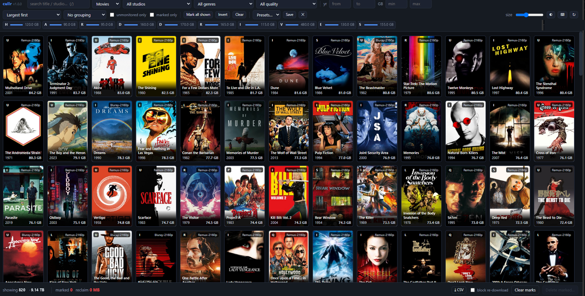
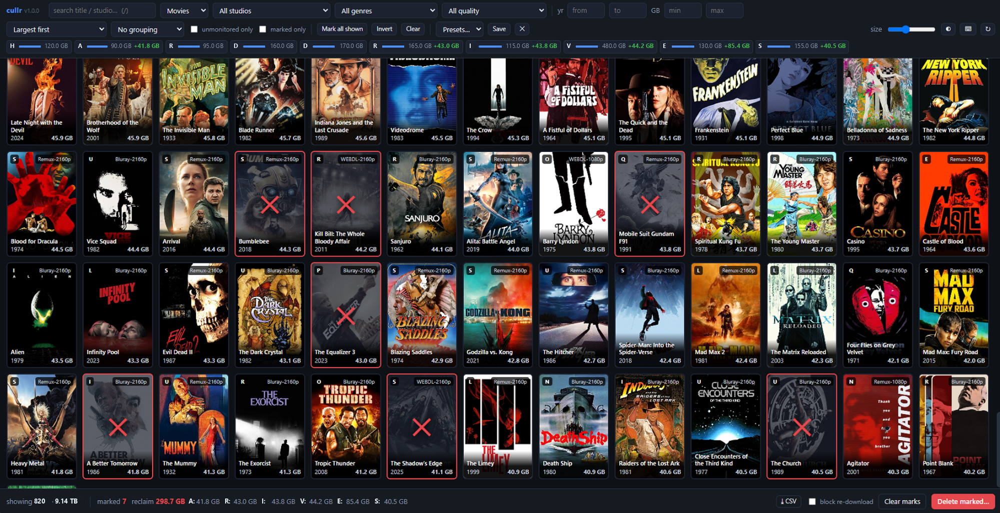

# cullr

Fast visual triage for reclaiming disk space from **Radarr** and **Sonarr**.

Deleting things in the *arr web UI is slow: scroll, click into a title, open a tab
to read the plot, go back, delete, confirm, repeat. cullr puts the whole library on
one dense poster wall sorted biggest-first, shows the synopsis on hover, and deletes
everything you marked in a single batch.

```
python -m cullr --open
```

No build step, no dependencies. Standard library only, Python 3.9+.



Mark what you want gone and every drive chip updates with what you would get
back, so you can see which disk the sweep actually frees before you commit to it.



---

## What it does

* **Poster wall, biggest first.** Every decision is made against the file that costs
  you the most, so the first hundred choices reclaim the most space.
* **Synopsis on hover.** Plot, studio, genres, rating, certificate, runtime, codec,
  HDR type, exact size and full path, without leaving the grid.
* **Drill-down filters.** Search, studio, genre, quality tier, year range, size range,
  drive, monitored state. Stack them freely.
* **Grouping.** By studio, genre, quality, drive or decade. Each group shows its total
  footprint and gets a *mark all* button, so a whole category goes in two clicks.
* **Per-drive targeting.** Drive chips show live free space and turn red under 50 GB.
  As you mark, each chip shows what you would get back, so you can free the drive that
  is actually full instead of one that is not.
* **Batch delete.** Confirmation lists every title with its size and drive before
  anything happens. Deletions run through the *arr API, chunked, with a live log.
* **Audit log.** Every deletion is appended to `cullr-deletions.jsonl`.

## Downsizing: keep the title, drop the 60 GB copy

Deleting is not the only way to get space back. A 57 GB 2160p remux and a 13 GB
2160p web-dl are the same film; one of them costs you 44 GB. **Shift-click** (or
right-click, or press `s`) any poster to search your indexers for a smaller copy
of that exact movie.

The panel shows every candidate release smallest-first, with its quality, size,
age, indexer, and the number that matters most: **how much you would save**. Set
a size cap and pick one; cullr hands it to Radarr and the big file gets replaced
on import.

Radarr will not import a downgrade while the movie's current quality profile says
the existing file already meets cutoff. Every smaller release comes back rejected
with *"Existing file meets cutoff"*. So the panel asks for a **target profile**
and switches the movie onto it before grabbing. Skip that switch and every grab
is refused.

Options in the panel:

* **target profile**: which profile the movie moves to (e.g. `HD-1080p`)
* **max GB**: hides anything above the cap
* **delete current file first**: frees the space immediately rather than at import
  time. Leaves a gap until the download lands, so it is off by default.

Releases Radarr refuses to grab are shown greyed out with the reason, so you can
see why rather than guessing. Every downsize is written to the audit log with the
before and after sizes.

Movies only for now. Sonarr's release search is per-episode, and a mis-click there
has a much larger blast radius.

## Install

Nothing to install. Clone or copy the folder and run it:

```bash
git clone https://github.com/LevonFrench/cullr && cd cullr
python -m cullr --open
```

Optionally install it as a command:

```bash
pip install -e .
cullr --open
```

## Configuration

Precedence, highest first: **flags → environment → config file → auto-discovery.**

On a machine where Radarr/Sonarr are installed locally, cullr reads their
`config.xml` and needs no configuration at all. It looks in the usual places for
Windows, macOS, Linux and the linuxserver.io containers.

### Flags

```
--host ADDR              bind address (default 127.0.0.1)
--port N                 bind port (default 8420)
-o, --open               open a browser once listening

--radarr-url URL         e.g. http://127.0.0.1:7878
--radarr-key KEY
--sonarr-url URL
--sonarr-key KEY
--no-radarr              ignore Radarr
--no-sonarr              ignore Sonarr
-c, --config PATH        path to a cullr.json

--read-only              browse only; the server refuses every delete
--dry-run                accept deletes and log them, never call the *arr API
--no-audit               do not append to cullr-deletions.jsonl

--check                  verify connectivity, print a summary, exit
--version
```

### Environment

```
CULLR_HOST  CULLR_PORT
CULLR_RADARR_URL  RADARR_API_KEY
CULLR_SONARR_URL  SONARR_API_KEY
CULLR_ACCESS_LOG=1        enable request logging
```

### Config file

Looked up at `./cullr.json`, `$XDG_CONFIG_HOME/cullr/config.json`,
`~/.config/cullr/config.json`, then `~/.cullr.json`. See `config.example.json`.

```json
{
  "port": 8420,
  "radarr": { "url": "http://127.0.0.1:7878", "key": "YOUR_KEY" },
  "sonarr": { "url": "http://127.0.0.1:8989", "key": "YOUR_KEY" },
  "read_only": false,
  "cache_ttl": 300
}
```

## Keyboard

| key | action |
|---|---|
| `/` | focus search |
| `Space` | mark / unmark the item under the cursor |
| `← → ↑ ↓` | move the cursor |
| `Enter` | open the delete confirmation |
| `a` / `i` / `c` | mark all shown / invert / clear marks |
| `g` | cycle grouping |
| `r` | reload from Radarr/Sonarr |
| `t` | toggle theme |
| `?` | shortcut list |

## Sorting

Largest first · most oversized for its quality tier · most GB per hour · newest ·
oldest · lowest rated · most obscure · recently added · longest held · title.

*Most oversized for its quality tier* compares each file against the median size of
everything else at the same quality, which surfaces the outliers worth re-grabbing at
a sane bitrate. You keep the title, you just stop storing a 70 GB copy of it.

## Safety

Deletion is destructive and permanent. cullr defends against accidents in layers:

* nothing is deleted until you open the confirmation and confirm it
* the confirmation lists **every** title with its size and drive
* `--dry-run` rehearses a full sweep without touching anything
* `--read-only` disables deletion server-side; the UI hides the controls
* every deletion is appended to `cullr-deletions.jsonl` with timestamp, title,
  size and path
* marks survive a page reload, so a long session is not lost to a stray refresh

**Try a small batch first.** Confirm it does what you expect before a large sweep.

The `block re-download` toggle adds an import exclusion so the *arr never re-grabs
what you removed. Leave it off if you only want the file gone for now.

## Notes

* Binds to `127.0.0.1` and has no authentication, because the only credentials
  involved are your own API keys and they never leave the machine. If you bind to a
  routable address, put it behind a reverse proxy that handles auth.
* Posters are proxied through the *arr API, so remote and containerised instances
  work the same as local ones.
* The library snapshot is cached for `cache_ttl` seconds; `r` or `↻` forces a reload.
* Sonarr entries are whole series. Season-level deletion is not exposed. That is
  deliberate, since the blast radius of a mis-click is much larger.

## License

MIT. See `LICENSE`.
